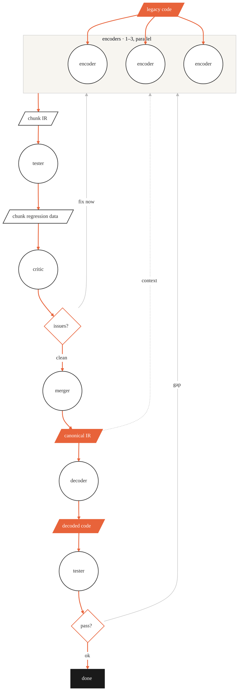

<!-- FRAMEWORK FILE: improvements → PR to semantic-autoencoder -->


# Draw Workflow

Maintain `docs/workflow.md` — the single source of truth for agent order and data flow.
Every diagram uses the house style below so all diagrams stay visually consistent.

**When to run:** any time you add/remove an agent, change the order, or change what each
agent reads/produces. The `/orchestrate` skill and the orchestrator agent both defer
diagram maintenance to this skill.

---

## House style (do not deviate)

Aesthetic: minimal, technical, elegant. Warm off-white canvas, white nodes with thin
dark borders, orange for the forward pipeline, grey for feedback loops, a solid black
terminal.

### Layout

**Vertical, top-to-bottom (`flowchart TD`).** Data flows downward through the agents.

### The orchestrator is not drawn

Every agent is dispatched by the orchestrator — that is a given, so it is omitted to keep
the diagram about the data and the agents. Show the pipeline as data flowing through
agents, not as a coordinator dispatching them.

### Shape grammar

| Meaning | Mermaid shape | Example |
|---------|---------------|---------|
| Data — input, artifact, intermediate product | parallelogram `[/ /]` | `CI[/chunk IR/]` |
| Headline data — input, canonical IR, final output | parallelogram, `keydata` class (orange) | `T[/legacy code/]` |
| Task / action | rectangle `[ ]` | `P[plan run]` |
| Agent | circle `(( ))`, **all the same size** | see below |
| Decision / gate | diamond `{ }` | `C{issues?}` |
| Terminal "done" | rectangle, `terminal` class | `D[done]` |

Data is never a rectangle or a circle; agents are always circles. Fill the three
headline artifacts (the input, the canonical IR, the final decoded output) with the
orange `keydata` class so the milestones stand out; intermediate data stays white.

### Uniform circles (required)

Mermaid sizes a circle to its label, so equal-diameter circles require equal-width
content. Wrap **every** agent name in a fixed-width HTML label:

```
E(("<div style='width:90px;text-align:center'>encoder</div>"))
```

Use the same `width` (90px) for every agent. Do not pad with spaces or `&nbsp;` — a
non-breaking space is narrower than an average glyph, so the longest real name still
comes out bigger.

### Parallel agents

When several copies of an agent run in parallel, group them in a labelled subgraph and
fan the input into each member. The subgraph also gives feedback loops a single target:

```
subgraph ENC [encoders · 1–3, parallel]
  direction LR
  E1(("<div style='width:90px;text-align:center'>encoder</div>"))
  E2(("<div style='width:90px;text-align:center'>encoder</div>"))
  E3(("<div style='width:90px;text-align:center'>encoder</div>"))
end
T --> E1           %% fan the input to each member
T --> E2
T --> E3
ENC --> CI         %% but emit ONE arrow from the GROUP to the next node
```

The diagram shows 3 encoder circles (the maximum); the actual number dispatched per
chunk (1–3) is decided by the orchestrator based on chunk complexity and capped by
`encoders.max_parallel` in the project config.

**Feedback loops return to the group; the group emits one output arrow.** All feedback
(`context`, `fix now`, `gap`) loops back into the encoder group. Those loops pull the
layout sideways, so if each member drew its own arrow to the next node, the off-centre
member's arrow would cross behind a sibling. Emitting a single arrow from the group
(`ENC --> CI`) avoids that entirely:

```
ENC --> CI             %% one group output — no crossing
CN -.->|context| ENC   %% data context → encoders
C  -->|fix now| ENC     %% rework → re-run the encoders
V  -->|gap| ENC
```

(Trade-off: this draws one arrow from the `encoders` box rather than one per encoder. If
you instead want one arrow *per* encoder, the loops can't also point into the group —
they would shove `chunk IR` off-centre and make an arrow cross. Pick one.)

The same agent may also appear at more than one point if it runs more than once (e.g.
`tester` generates regression data, then later validates the decoded code).

### Edge labels

Lowercase, short. Put them on the edge: `C -->|fix now| ENC`. Name the action or the
data, never a code symbol.

### Colour palette

| Token | Hex | Use |
|-------|-----|-----|
| Canvas | `#F7F5F0` | background |
| Ink | `#333333` | borders, primary text, arrows |
| Accent | `#E8633A` | the forward pipeline, decision diamonds, headline-data fill |
| Mute | `#BBBBBB` | feedback-loop arrows |
| Cluster border | `#CCCCCC` | subgraph outline |
| Terminal | `#1A1A1A` | solid "done" node |

---

## Required header block

Every diagram starts with this init directive and these `classDef`s. Copy verbatim;
only the nodes and edges change.

````markdown
```mermaid
%%{init: {'theme':'base','themeVariables':{
  'fontFamily':'ui-sans-serif, system-ui, -apple-system, sans-serif','fontSize':'14px',
  'primaryColor':'#ffffff','primaryTextColor':'#333333','primaryBorderColor':'#333333',
  'lineColor':'#333333','tertiaryColor':'#F7F5F0','background':'#F7F5F0',
  'clusterBkg':'#F7F5F0','clusterBorder':'#cccccc'
}}}%%
flowchart TD

  %% ---- data (parallelogram) ----
  %% ---- agents (uniform circles; subgraph for parallel) ----
  %% ---- decisions (diamond) + terminal ----
  %% ---- edges ----

  classDef data     fill:#ffffff,stroke:#333333,stroke-width:1.5px,color:#333333;
  classDef keydata  fill:#E8633A,stroke:#E8633A,stroke-width:1.5px,color:#ffffff;
  classDef agent    fill:#ffffff,stroke:#333333,stroke-width:1.5px,color:#333333;
  classDef decision fill:#ffffff,stroke:#E8633A,stroke-width:1.5px,color:#333333;
  classDef terminal fill:#1A1A1A,stroke:#1A1A1A,stroke-width:1px,color:#ffffff;

  %% orange = forward pipeline; grey = feedback loops
  %% linkStyle <forward indices> stroke:#E8633A,stroke-width:2px;
  %% linkStyle <loop indices>    stroke:#BBBBBB,stroke-width:1px;
```
````

### Rules for applying classes and links

1. Class every node: `data` (white parallelogram) or `keydata` (orange parallelogram for
   the headline artifacts), `agent` (circle), `decision` (diamond), `terminal` (black).
   Subgraph member circles are still `agent`.
2. Colour the **forward pipeline** edges orange and the **feedback-loop** edges grey,
   by edge index (`linkStyle`, counting from 0 in declaration order).
3. Draw feedback as labelled loop-back edges (`context`, `fix now`, `gap`) to the
   relevant agent or subgraph.
4. The final node is `terminal` (solid black).

---

## Procedure

1. **Read the current agent set.** List `.claude/agents/*.md` (ignore the orchestrator)
   and read each frontmatter `description` to learn the role and where it sits.
2. **Read the current `docs/workflow.md`** to see what's there now.
3. **Lay out the pipeline** top-to-bottom: input data → agents in order, alternating with
   the data they produce → decision gates → terminal. Group parallel agents in a
   subgraph; repeat an agent if it runs more than once; add the feedback loops.
4. **Fill the header block.** Give every agent a 90px fixed-width label so the circles are
   uniform. Set `linkStyle` to colour forward edges orange and loop edges grey.
5. **Add the stage table and feedback-loop notes** below the diagram so the file is
   useful to humans, not just a picture.
6. **Write `docs/workflow.md`.** Exactly one ```mermaid``` block; one file.
7. **Render to verify** if `@mermaid-js/mermaid-cli` is available:
   `npx -y @mermaid-js/mermaid-cli -i docs/workflow.md -o /tmp/wf.png -b '#F7F5F0'`
   (add `-p puppeteer.json` with `{"args":["--no-sandbox"]}` if Chromium needs it).
   Otherwise sanity-check: brackets balanced, every node classed, every `linkStyle`
   index in range.

---

## Worked example (this project's pipeline)

````markdown

````

Notes on this example:
- **Parallel fan-out:** `legacy code` feeds three `encoder` circles individually; the
  group emits a single arrow to `chunk IR` (`ENC --> CI`). The diagram shows the maximum
  of 3; the actual per-chunk count (1–3) is chosen by the orchestrator based on complexity.
- **Headline data orange:** `legacy code`, `canonical IR`, `decoded code` use `keydata`.
- **Repeated agent:** `tester` appears twice — regression data, then decoded validation.
- **Feedback (grey):** `context`, `fix now`, and `gap` all loop back to the encoder
  group; the single group output (`ENC --> CI`) keeps the diagram clean.
- **Scope:** the diagram shows the workflow for **a single chunk**. The orchestrator
  manages the outer loop: parts → chunks → iterate.

Keep the diagram honest: if you change the agent roster or the order, re-run this skill
so the picture never drifts from reality.