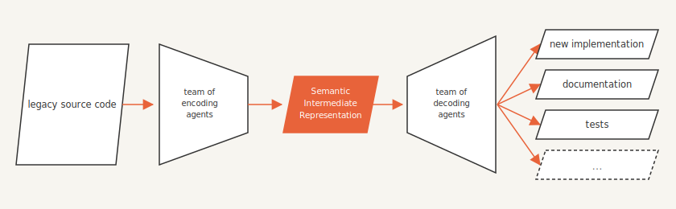

# semantic-autoencoder

Stop refactoring the refactor. Extract a legacy codebase's meaning once, then regenerate the implementation whenever the language, framework, or hardware moves on.

An agent worlflow to extract the meaning of a legacy codebase into a language-independent Semantic Intermediate Representation (IR) — and make that IR, not the code, your source of truth.

---

## The core idea

An autoencoder squeezes an input down to a compact latent code, then reconstructs
the input from that code alone. The latent is where the meaning lives; the pixels
are just one way of spelling it out.

This project does the same to source code. A legacy program is already a compressed
implementation of some underlying model — scientific, mathematical, algorithmic,
business, whatever the code was written to capture. We **encode** the source into a
language-independent **Semantic Intermediate Representation (SIR)** — the latent — and
later **decode** it into whatever we need: a fresh clean implementation, documentation,
a test suite, and more.

<p align="center">
  
</p>

*The source is one of many spellings; the Semantic IR is the latent and the single source
of truth; every output — implementation, docs, tests — is a derived artifact decoded from
it, in any language.*

The objective is **not** code translation. It is **semantic extraction**. A line-by-line
port carries the accidents of the original — its language, its era, its quirks — straight
into the new code. We want the meaning without the accidents.

Unlike a neural autoencoder, the latent here is **human-readable and auditable**. And
unlike a compiler IR (SSA, LLVM IR), which is low-level and built for machines, the SIR
is high-level, interpretable, and extensible — it records *behavioral invariants and
intent*, not register moves. It is something a domain expert can read, check, and
correct.

---

## Who this is for

Research groups in academia, national labs, and large organizations sitting on big,
old simulation codes — decades of physics, chemistry, and engineering knowledge locked
inside Fortran, C, and MATLAB that no current team member fully understands, and that
nobody wants to rewrite by hand.

---

## Why bother

Languages, libraries, hardware, and "best practices" have churned fast and are about to
churn faster. LLMs and vibe coding make it impossible to fully track that churn. So you
refactor — and then you refactor the refactor, and then you refactor that. It never ends,
because the thing you keep editing is always a *spelling*, never the meaning.

Break the loop by extracting the meaning **once**. After that:

- The **Semantic IR is the primary product and the single source of truth.**
- Every generated codebase is a **derived artifact** — regenerate it whenever the target
  language, framework, or hardware changes.
- Extraction happens once. From then on, any change with global scope is made **in the
  SIR**, and the artifacts are re-decoded from it.

You stop maintaining N aging codebases and start maintaining one auditable model.

---

## What the Semantic IR captures

The encoder must recover everything needed to regenerate the system, and nothing that
merely reflects how it happened to be written:

- Physical and mathematical meaning
- Governing equations and constraints
- Quantities, units, and coordinate systems
- Numerical algorithms and discretization schemes
- Execution order and state transitions
- Validation invariants and expected behavior

Code names, file layout, module structure, and serialization formats are **not**
preserved by default — they live only in `source:` provenance metadata, never in the
meaning itself.

---

## Behavioral equivalence, not byte-level determinism

A decoded implementation must behave like the original where behavior matters — not
reproduce it byte for byte. Two consequences:

- **Not all legacy code is source of truth.** Fortran-77-isms, dead branches, and
  accidental implementation details don't have to carry over. If the decoded function
  has a different name, a different file layout, or a different language — who cares.
  The SIR is language-agnostic by default (override per-project only when you truly need
  a specific API or format preserved).
- **Equivalence is verified, not assumed.** Regression testing is the backbone: the
  original binary generates reference data, and the decoded implementation is checked
  against it. That feedback is also how we know the extraction is *complete* — we keep
  the SIR as minimal as possible while continuously confirming it's still enough.

The success criterion: **a decoder can regenerate an equivalent implementation without
ever reading the original source.** When that holds, the original can be discarded.

---

## Applications

The same extract-once, decode-many loop serves very different goals depending on what
you do with the Semantic IR:

1. **Modernization & language migration** — Fortran  / MATLAB → a modern target; the canonical legacy problem, in science and in business.
2. **Hardware retargeting & performance portability** — one IR, many backends (CPU, GPU, future accelerators); re-decode when the hardware changes instead of rewriting. Vectorization / threading / MPI→task-based restructuring decided at decode time.
3. **Differentiable & ML-native rewrites** — decode to JAX/PyTorch for automatic differentiation and adjoints built on already-extracted governing equations. Natural feedstock for PINNs, neural operators, and ROMs
4. **Verification, validation & regulatory** — the IR is an auditable specification and the regression harness its evidence trail; supports safety-critical recertification and export / IP review.
5. **Comprehension, documentation & onboarding** — auto-generate the "math behind the code" and surface hidden assumptions, unit mismatches, and coordinate-frame bugs.
6. **Knowledge preservation** — capture a retiring expert's code before the knowledge leaves; a Rosetta Stone for codes whose authors are gone and whose docs are lost.
7. **Reproducibility & open science** — publish the IR alongside a paper as the canonical, language-independent model; enable independent replication. Cross-group standardization: a community decodes one shared SIR instead of maintaining N divergent codes of "the same" model.
8. **Consolidation & coupling** — reconcile drifted forks into one source of truth; align interfaces, units, and frames before coupling multi-physics components. Semantic diff between two versions of a code.
9. **Testing & quality** — generate regression and property tests from extracted invariants; run differential testing of original vs. decoded.
10. **Auditing AI-generated code** — round-trip LLM-written code through an IR to check it still encodes the intended model.
11. **Research directions** — an IR corpus as training and evaluation data for code-understanding models, a bridge to formal methods, and clean specs for teaching numerical methods.

---

## How it works

The work is run by a small team of specialized agents, coordinated one chunk at a time.
An **orchestrator** splits the codebase into **parts** (coarse logical groupings), then
into **chunks** (fine-grained units, encoded in dependency order so each one sees the
meaning established so far). For each chunk it dispatches parallel **encoder** agents, a
**tester** to generate regression references, and a **critic** review, then a **merger**
folds the result into the canonical IR. Decoding runs after all chunks are complete.

The full pipeline — every agent, what it reads and writes, and the feedback loops — is
drawn in **[docs/workflow.md](docs/workflow.md)**.

---

## Quickstart

**Requirements:** Claude Code CLI (`claude`).

> Claude Code is the current requirement only because it is how the project is implemented today. The framework is meant to be **LLM-agnostic** — the agents, IR schema, and workflow carry no Claude-specific assumptions, and support for other agent runtimes may land soon.

1. Create your project from the template. On GitHub, click **Use this template → Create a
  new repository** (this is a template repository), then clone your new repo:
  ```bash
  git clone https://github.com/<you>/<my-project> && cd <my-project>
  ```
  Your project is an independent repo with no shared history; pull framework updates later
  with `./sync-framework.sh` (see [Staying in sync](#staying-in-sync-with-the-framework)).

2. Copy your legacy code into encoded/
  ```bash
  cp -r /path/to/legacy/code encoded/legacy/<project-name>
  # or: git submodule add <url> encoded/legacy/<project-name>
  ```

3. Open Claude Code and run setup
  ```bash
  claude
  > /setup
  ```
  `/setup` interviews you about the codebase, domain, and preferences, then:
  - Writes `config/project_config.yaml`
  - Creates the `explain-domain` skill (domain reference knowledge for all agents)
  - Creates the `run-legacy` skill (how to execute the original code)

4. Start encoding:
  ```
  > /orchestrate
  ```

---

## Staying in sync with the framework

This repo is a **template repository**, so your project starts as an independent copy with
no shared git history — a plain `git pull` can't bring framework improvements across. Use
[`sync-framework.sh`](sync-framework.sh) instead. It clones the latest upstream, diffs each
framework file against your copy, and lets you **review and apply each change selectively**
— one command, explicit review, never an automatic merge:

```bash
./sync-framework.sh                # interactive, file-by-file review
./sync-framework.sh --patch-only   # write framework-sync.patch to apply by hand (hunk-level)
./sync-framework.sh --list         # list the tracked framework files
```

Which files are framework-owned is defined in [`framework-files.txt`](framework-files.txt);
your `README.md`, `config/`, domain skills, and IR are project-owned and never touched.
Improvements flow the other way too — open a PR upstream and every project can pull it at
its own pace. See [CONTRIBUTING.md](CONTRIBUTING.md).

---

## Directory structure

```
encoded/          — Your legacy codebase. Immutable after copying in.
semantic_ir/      — Extracted knowledge (the primary product)
  canonical/      — Authoritative merged IR
  chunk_NNN/      — Per-chunk working artifacts
decoded/          — Decoder output: self-contained reimplementation
regression_tests/ — Reference data from the original binary
artifacts/        — Orchestration planning (manifests, chunk plans)
workspaces/       — Temporary run outputs (disposable)
config/           — Project config (generated by /setup)
docs/             — This framework's documentation
.claude/
  agents/         — Six specialist subagents
  rules/          — Path-scoped conventions (auto-loaded)
  skills/         — Invocable workflows (/setup, /orchestrate, /draw-workflow)
                    + three project-created skills (explain-domain, run-legacy, run-decoded)
```

---

## Agents

| Agent | Role |
|-------|------|
| **orchestrator** | Plans parts and chunks, schedules all other agents, tracks progress |
| **encoder** | Extracts semantic facts from legacy source into chunk IR |
| **critic** | Reviews chunk IR for consistency, leakage, and decoder readiness |
| **merger** | Consolidates chunk IRs into the canonical IR |
| **decoder** | Reconstructs the equivalent implementation from canonical IR only |
| **tester** | Generates regression reference data; validates decoded output |

---

## Skills

| Skill | Invocation | Purpose |
|-------|-----------|---------|
| `/setup` | User | One-time project interview; creates config and domain-specific skills |
| `/orchestrate` | User | Drive the full encode → critique → merge → decode pipeline |
| `/draw-workflow` | User | Regenerate the Mermaid workflow diagram in house style |
| `/explain-domain` | Auto + user | Domain reference knowledge (created by `/setup`) |
| `/run-legacy` | User | Run the legacy binary in a sandboxed workspace (created by `/setup`) |
| `/run-decoded` | User | Install and run the decoded package (created by `/orchestrate` pre-decode) |

---

## Contributing improvements back

**This is a work in progress** — and deliberately so. Agent workflows, and the agents
themselves, are changing fast; what counts as a good `CLAUDE.md`, a well-scoped agent, or
a useful skill is still a moving target. The only way to get this right is to keep
exercising it on real legacy codebases and upgrading the framework — `CLAUDE.md`, agents,
skills, rules — based on what actually breaks and what actually works. **Everyone is
welcome to contribute.**

If you improve an agent, skill, or rule that is part of the generic framework
(not domain-specific), ***please*** open a pull request to this repository. See
[CONTRIBUTING.md](CONTRIBUTING.md) for the PR flow and what counts as framework
vs. project-owned.

Framework agents, skills, and rules are marked at the top:
```
<!-- FRAMEWORK FILE: improvements → PR to semantic-autoencoder -->
```
(`CLAUDE.md`, `README.md`, and `docs/workflow.md` are framework files too, but carry
no marker — they are unambiguously framework-level.)

Domain-specific files (`explain-domain`, `run-legacy`, `run-decoded`) are project-owned
and should stay in your project repo.

---

## Acknowledgments

The ideas behind this project grew out of conversations with **Prof. Marco Panesi** and the
**HERMES Group** (Hypersonic Entry & Reentry Multiscale Experiments & Simulation) at the
University of California, Irvine.
