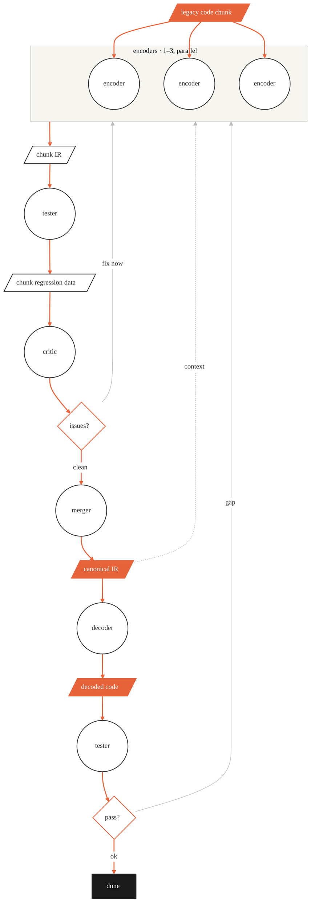

<!-- FRAMEWORK FILE: improvements → PR to semantic-autoencoder -->

# Semantic Autoencoder Workflow

Single source of truth for agent order and data flow.
Regenerate with `/draw-workflow` whenever agents or their sequence change.

## Scope of this diagram

**This diagram shows the workflow for a single chunk.**

The orchestrator (not drawn) manages the full pipeline:

1. It splits the legacy codebase into **parts** (coarse logical groupings).
2. It splits each part into **chunks** (fine-grained units of work).
3. It iterates the encode → test → review → merge cycle over every chunk, in
   dependency order, before running the final decode and validation.

The diagram below is what happens inside one iteration of that loop.
The orchestrator dispatches every agent shown; every agent is dispatched by it.

## Stage descriptions

| Stage | Agent | Reads | Writes |
|-------|-------|-------|--------|
| Extract semantics | encoder ×1–3 (parallel; count set by orchestrator based on chunk complexity and user preference) | `encoded/legacy/` + accumulated `semantic_ir/canonical/` | `semantic_ir/chunk_NNN/` |
| Generate regression data | tester | `encoded/legacy/` (binary) | `regression_tests/` |
| Review quality | critic | `semantic_ir/chunk_NNN/` | `semantic_ir/chunk_NNN/99_review/` |
| Merge to canonical | merger | `semantic_ir/chunk_NNN/` | `semantic_ir/canonical/` |
| Decode | decoder | `semantic_ir/canonical/` **only** | `decoded/` |
| Validate decoded | tester | `regression_tests/` (reference) | `decoded/regression_tests/` |

## Feedback loops (grey)

All three return to the **encoders**:

- **context** — the canonical IR built by the merger feeds back as context to the
  encoders, so later chunks never re-derive or contradict established facts.
- **fix now** — a failing critic review re-runs the encoders.
- **gap** — a failing validation re-runs the encoders to patch the IR gap before
  re-decoding.

The encoder group emits a single arrow to `chunk IR`; routing the loops into the group
this way keeps that output arrow from being pushed off-centre.

## Legend

- **Parallelogram** — data: input, artifact, or intermediate product
- **Orange parallelogram** — the headline artifacts: input, canonical IR, decoded output
- **Circle** — agent (own context window, own tools); all drawn the same size
- **Diamond** — decision or quality gate
- **Solid black** — terminal state
- **Orange arrow** — the forward pipeline
- **Grey arrow** — a feedback loop